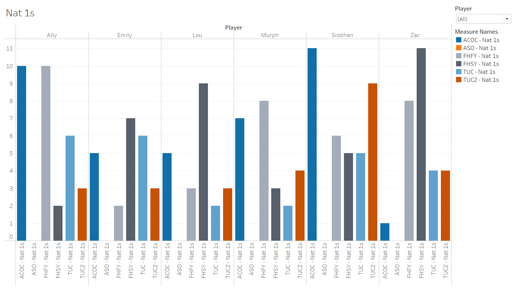
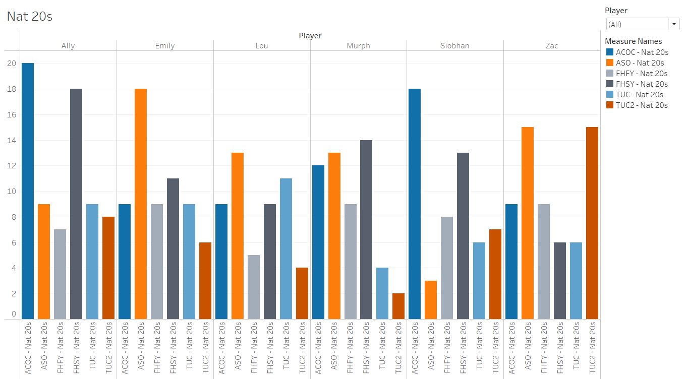

# Project Notes
-   [Initial Acquisition](#initial-acquisition)
-   [Work Done in Excel](#work-done-in-excel)
-   [Initial Findings](#initial-findings)
### Initial Acquisition
-   Data is not readily available, there is a community member who used to keep track of some statistics, but they have not been active for some time
-   It appears nobody is actively tracking stats in a way that is publicly available
-   Community members are, however, keeping accurate transcripts of episodes, that *are* readily available
    -   They are available as read-only google docs and aren't easily downloadable
    -   Will batch-download the html files 
-   Would theoretically use NLP for going through some of this, but I'm not sure if it will actually be applicable here since we'll only be looking for a few key phrases, and don't necessarily need a model that needs to process any complex speech

### Work Done in Excel
-   Corrected players who were referenced by character names in the script
-   Removed instances of players referencing rolls they did not specifically make (e.g. 'I wish I rolled a nat 20')
-   Found instances of rolls that were missing attribution to a player, so manual script review to find context was done for accuracy
    -   Would like to do a manual video review for some of these in the future

### Initial Findings

-   It appears that there were no Nat 1s in ASO (A Starstruck Odyssey), which feels unlikely
-   It does appear that some players have more extreme rolls than others
-   Data does not take into account total # of rolls per season, whether rolls were made with advantage/disadvantage, etc.
-   